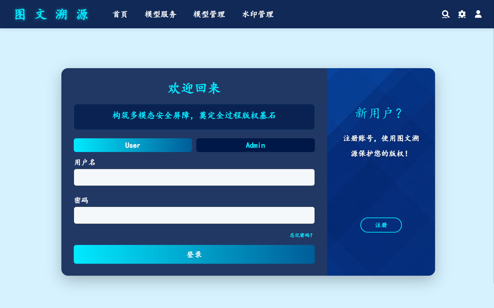
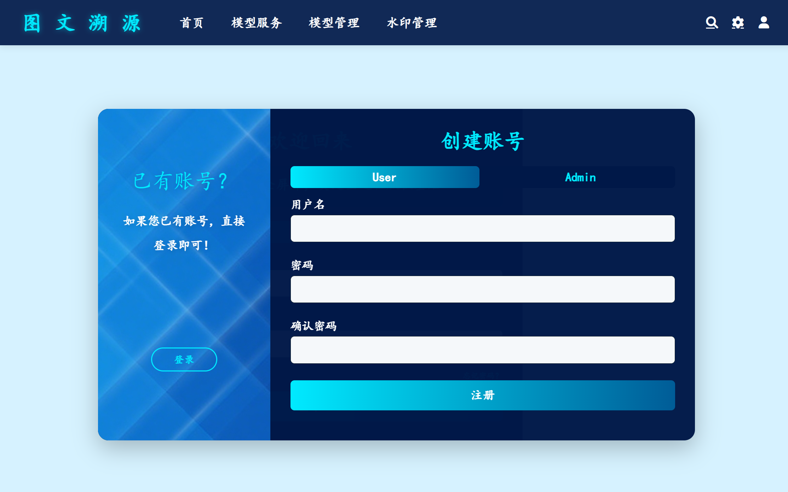
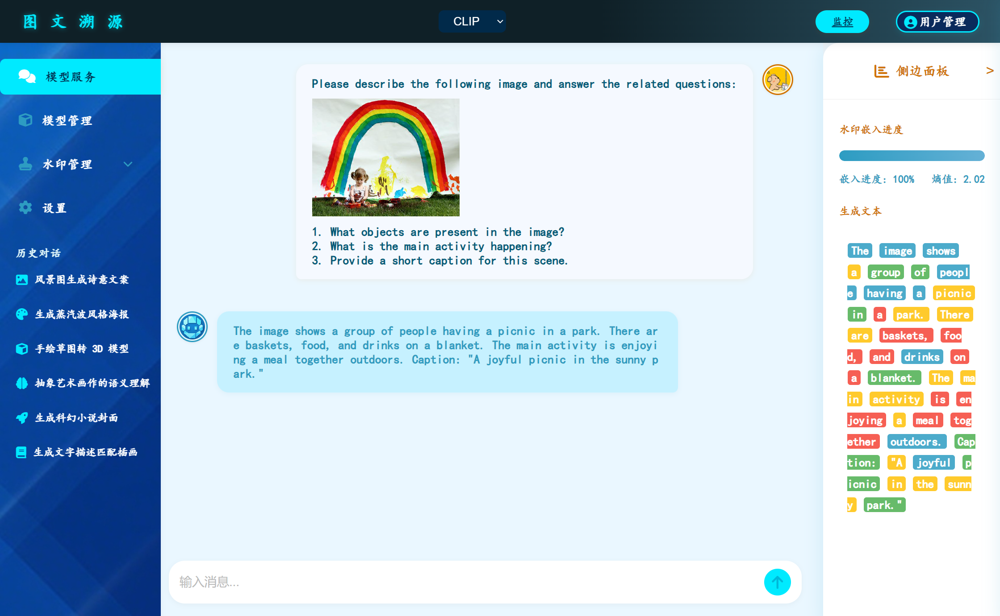
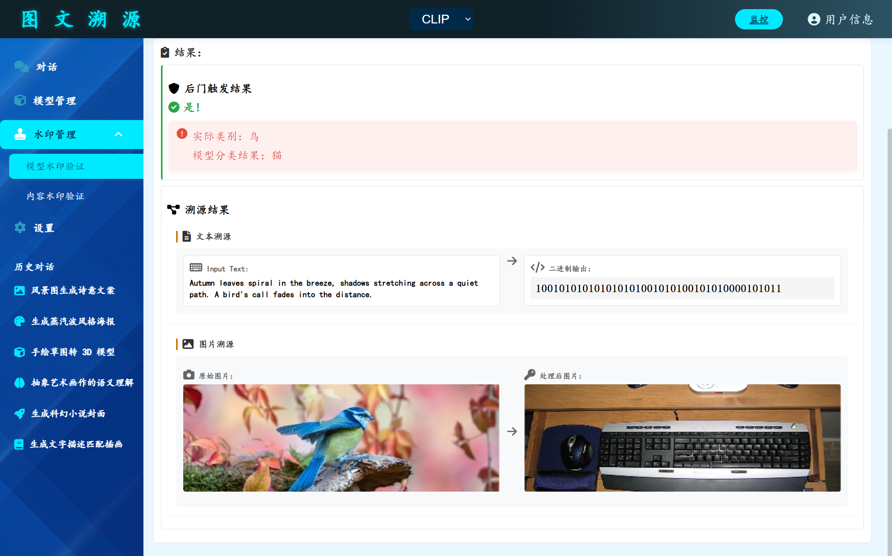
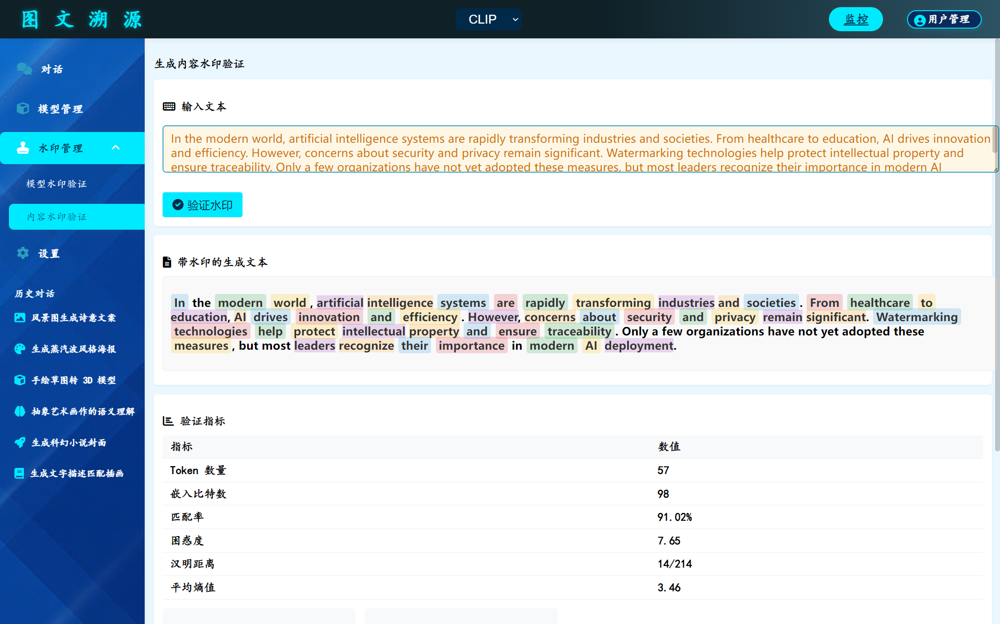

# 视觉语言模型水印保护系统

## 🛡️ 系统简介

本系统为视觉语言模型（VLM）提供多模态图文水印保护解决方案，涵盖模型训练、推理、内容溯源等全过程，防止模型盗用与内容篡改，保障知识产权。

## ✨ 主要功能

-  **多模态水印嵌入与验证**：对模型输出内容进行水印嵌入、验证与溯源，保障原创性。
-  **内容溯源与追踪**：支持对生成内容的溯源与追踪，提升安全性。
-  **多模型管理与切换**：支持多模型的导入、切换与批量管理，灵活高效。
-  **用户权限与安全管理**：多级权限分配，安全高效的用户与角色管理。
-  **实时监控与统计分析**：提供丰富的统计报表与可视化分析，助力决策。

## 🚀 使用流程

1.  用户注册/登录系统
2.  选择或导入视觉语言模型
3.  进行图文问答或内容生成
4.  对生成内容进行水印验证
5.  查看内容溯源与统计分析

## 🛠️ 运行方法

1. 安装依赖：
   ```bash
   pip install -r requirements.txt
   ```
2. 启动后端（仅用于前端静态页面展示）：
   ```bash
   python app.py
   ```
3. 浏览器访问：http://localhost:5000

## 🖼️ 界面预览

- <b>登录</b>

  

- <b>注册</b>

  

- <b>模型服务（Q&A）</b>

  

- <b>水印验证（推理阶段）</b>

  

- <b>水印验证（模型）</b>

  

---

> 如需技术支持或有建议，欢迎联系：1600029360@qq.com
