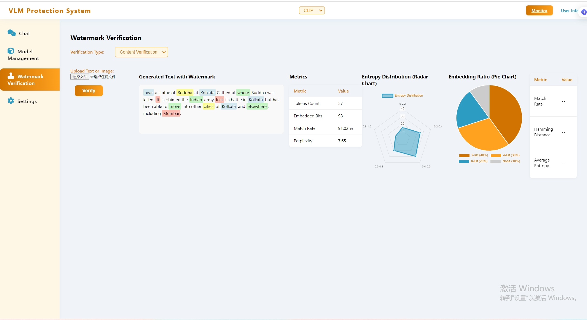

# 视觉语言模型水印保护系统（前端原型）

## 运行方法

1. 安装依赖：
   ```bash
   pip install -r requirements.txt
   ```
2. 启动后端（仅用于前端静态页面展示）：
   ```bash
   python app.py
   ```
3. 浏览器访问：http://localhost:5000

4. 界面
   
   
   
   
   

## 说明

- 目前仅为前端界面原型，后端接口未实现。
- 颜色风格采用指定的 conic-gradient 渐变。
- 结构参考需求文档，后续可根据功能完善交互和数据。
